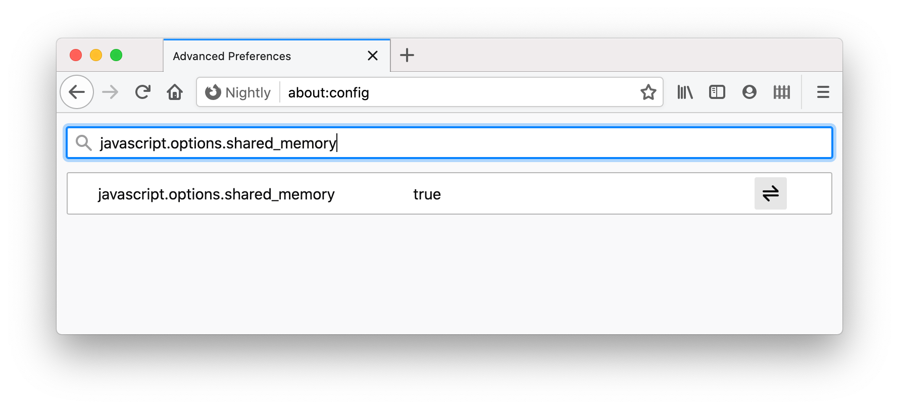
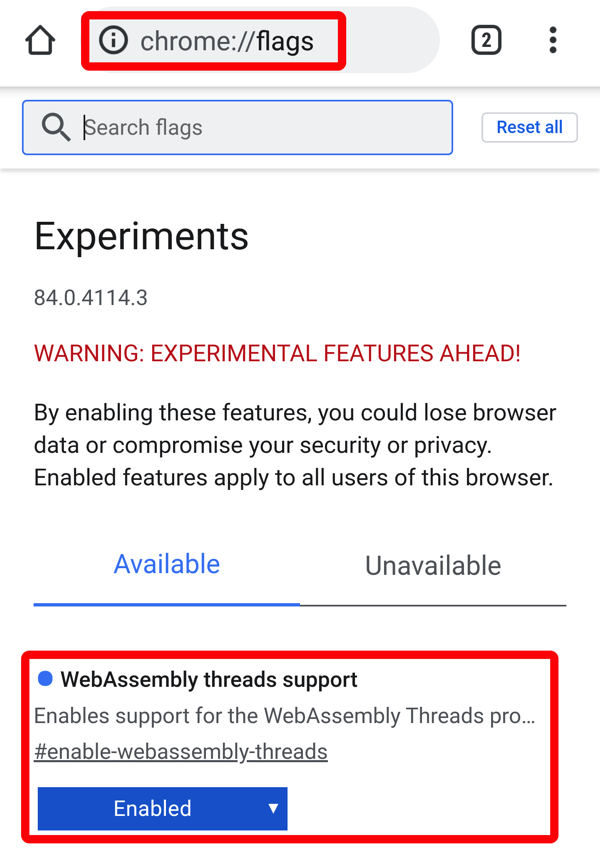

## WebAssembly requirements

While WebAssembly itself is supported on all WebXR-capable browsers, OpenSceneGraph assumes availability of threading and so must (at present) be built with WebAssembly's threads support enabled. Unfortunately, WebAssembly threads depends in turn on Javascript's `SharedArrayBuffer` type, which was disabled by default in most browsers to mitigate the "Spectre" attacks. While `SharedArrayBuffer` is being gradually re-enabled by default, your browser might need some help.

* At the date of writing, Firefox requires a config flag to re-enable SharedArrayBuffer. In Firefox, type `about:config` in the URL bar, accept the warning, and then in the config search box type `javascript.options.shared_memory`. Click the ⇌ arrows symbol so that the value changes to `true` and close the config.
* Firefox Reality has SharedArrayBuffer enabled by default.
* Chrome for Windows and macOS has SharedArrayBuffer enabled by default, provided "cross origin isolation" is enabled for your site. (See below for details on how to enable "cross origin isolation".
* Chrome for Android requires a config flag to re-enable SharedArrayBuffer, however this only works for Chrome Android versions prior to Chrome 83. In Chrome, type `chrome://flags` in the URL bar, and then in the flags search box type `WebAssembly threads`. Tap the pop-up and change the value from "Default" to "Enabled".
* Magic Leap Helio browser does not yet support multithreaded WebAssembly (as of Leap OS 0.98.10) although Magic Leap have tentatively committed to re-enabling support in a future release.
* Safari for macOS/iOS does not yet support SharedArrayBuffer.




### Enabling "cross origin isolation"

"Cross-origin isolation" refers to server-side config that enables protection features in the browser that make re-enablement of SharedArrayBuffer possible.

If your site is served by Apache, the simplest method is to create a `.htaccess` file in the top-level directory of your application with these lines included:

```
Header set Cross-Origin-Opener-Policy: same-origin
Header set Cross-Origin-Embedder-Policy: require-corp
```
To serve these, you will need to ensure that your apache config also loads the "headers" module. For Apache2, check the config file (`/etc/apache2/httpd.conf` or similar) has the option `LoadModule headers_module libexec/apache2/mod_headers.so` uncommented and enabled.
